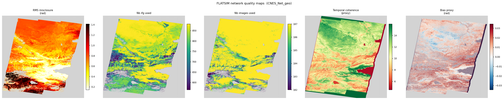
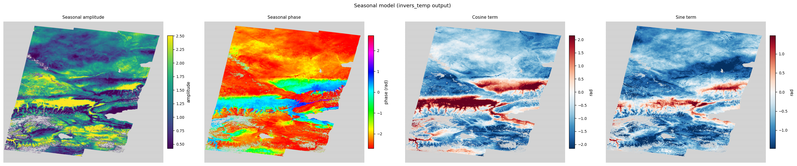
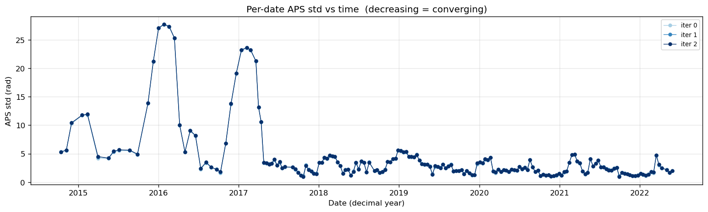
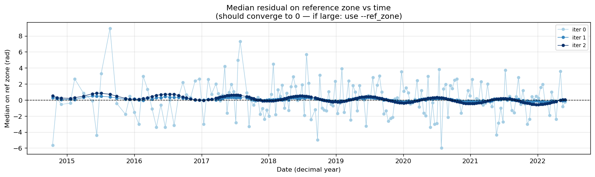

# flatsim_validate

Python scripts for validation and temporal inversion of FLATSIM Sentinel-1
time series products.

Replaces `flatsim2mp.sh`, `check_results.sh`, `check_results_inc.sh`
(MP Doin / ISTerre).

## Files

| File | Role |
|------|------|
| `utils.py` | I/O helpers for all FLATSIM file formats |
| `check_results.py` | Full pipeline: prepare → invert → validate |
| `check_results_inc.py` | Comparison plots between two TS runs |
| `invers_temp.py` | Temporal-only inversion (no spatial iterations) |
| `plot_avg_aps.py` | Plot APS std and reference zone median across iterations |

---

## Dependencies

```bash
pip install numpy scipy matplotlib gdal
pip install psutil      # recommended: auto block-size detection in invers_temp
pip install mplcursors  # optional: click-to-show date tooltip on scatter plots
```

---

## Directory convention

```
data/
└── <site>/<track>/          ← pass this to the scripts
    ├── TS/                  time series (CNES_DTs_geo_*.tiff, RMSdate.txt, …)
    ├── AUX/                 auxiliary data (baseline.rsc, list_iw*_sd_*.txt, …)
    └── VALIDATION/          figures written here (auto-created)
```

---

## Typical workflow

### Default — run everything automatically

```bash
python check_results.py data/Tienshan/D107_NORD/TS
```

This single command runs the full pipeline:
1. Prepares input files for inversion
2. Runs `invers_temp.py` automatically
3. Produces all validation figures in `VALIDATION/`

Figures are also copied to `AUX/` for archiving.

---

### Step by step

#### Step 1 — Prepare inputs only (no inversion, no plots)

```bash
python check_results.py data/Tienshan/D107_NORD --prepare
```

- `AUX/baseline.rsc` → `TS/list_images.txt`
- `TS/RMSdate.txt` → `TS/inrms.txt`
- Extracts `CNES_Net_geo_*.tiff` bands → `RMSpixel.tif`, `Net_nifg.tif`, etc.
- Prints the ready-to-run `invers_temp.py` command

#### Step 2 — Run the temporal inversion only

```bash
# First pass — no weights, to identify dates with strong APS
python invers_temp.py data/Tienshan/D107_NORD/TS --rms=none --aps=none

# Second pass — with weights and a stable reference zone
python invers_temp.py data/Tienshan/D107_NORD/TS --ref_zone=2180,2280,2320,2680
```

Key options:
```
--niter=2                   outer iterations            [default: 2]
--linear=yes                linear velocity term        [default: yes]
--seasonal=yes              annual cos+sin terms        [default: yes]
--cte_coh=0.4               IRLS + APS damping          [default: 0.4]
--ref_zone=l0,l1,c0,c1      reference zone for APS std  [default: full image]
--rmsl=10.0                 RMSpixel threshold          [default: 10.0]
--nproc=4                   CPU cores                   [default: 4]
--block_size=0              lines/block (0=auto)        [default: 0 = auto]
--rms=none                  disable RMS weighting       [default: auto-detect]
--aps=none                  disable APS weighting       [default: auto-detect]
```

#### Step 3 — Validate inversion results only

```bash
python plot_avg_aps.py data/Tienshan/D107_NORD/TS
```

Reads `aps_N.txt` and `ref_median_N.txt` from `TS/` and produces:
- `plot_aps_vs_time.png` — APS std per date, one curve per iteration
- `plot_median_vs_time.png` — Median residual on reference zone per date

If the median is large (> 1 rad), the reference zone includes deformation —
use `--ref_zone` to select a stable area.

#### Step 4 — Full validation without re-running inversion

```bash
python check_results.py data/Tienshan/D107_NORD/TS --no-inversion
```

#### Step 5 — Pass extra options to invers_temp.py

```bash
python check_results.py data/Tienshan/D107_NORD/TS \
    --invers-args "--niter=3 --ref_zone=2180,2280,2320,2680"
```

#### Step 6 — Incremental comparison (new vs previous run)

```bash
python check_results_inc.py \
    data/Tienshan/D107_NORD/TS \
    data/Tienshan/D107_NORD/INCREMENT
```

---

## Example results — Tian Shan D107 NORD (2014–2022)

### Burst time-latitude distribution


### Interferogram network (blue = kept, red = removed)


### Histogram of kept interferograms by temporal baseline


### Interferogram RMS vs temporal baseline + per-ifg index


### Ramp residuals — per-IFG variance vs per-image APS


### Network quality maps (RMSpixel, nifg, nimg, tcoh, bias)


### Seasonal model (amplitude, phase, cos, sin)


### APS std vs time (inversion convergence)


### Median residual on reference zone vs time


### SD variation along range and azimuth (IW1/2/3)
| Range | Azimuth |
|-------|---------|
|  |  |

### SD constant term and sigma
| Constant term | Sigma |
|---------------|-------|
|  |  |

### SD tôle ondulée and quadratic azimuth
| Tôle ondulée | Quadratic azimuth |
|--------------|-------------------|
|  |  |

### Unwrapping fraction vs season (blue = ok, red < 0.5)


---

## Output figures — `check_results.py`

| Step | Figure | Content |
|------|--------|---------|
| 1 | `check_plot_time_lat_iw*.png` | Burst time-latitude (one per subswath) |
| 2 | `check_sd_sx.png` | SD along range (IW1/2/3, click → date) |
| 2 | `check_sd_sy.png` | SD along azimuth |
| 2 | `check_sd_qy.png` | Quadratic SD along azimuth |
| 2 | `check_sd_syy.png` | SD tôle ondulée |
| 2 | `check_sd_sigma.png` | SD sigma |
| 2 | `check_sd_cst.png` | SD constant term |
| 3 | `check_iw_merge.png` | Phase jumps IW1-IW2 and IW2-IW3 |
| 4 | *(console)* | Interferogram statistics |
| 5 | `check_histo_bt.png` | Histogram of kept ifg by Bt |
| 6 | `check_unw_frac_vs_bt.png` | Unwrapping fraction vs Bt (red < 0.5) |
| 6 | `check_unw_frac_vs_season.png` | Unwrapping fraction vs season (red < 0.5) |
| 7 | `check_rms_date.png` | Per-date RMS |
| 8 | `check_rms_ifg_vs_bt.png` | Ifg RMS vs Bt + per-ifg barplot |
| 9 | `check_variance_comparison.png` | Per-IFG variance + per-image APS |
| 10 | `check_ifg_network.png` | Interferogram network |
| 11 | `check_sigma_vs_time.png` | Per-image APS vs time |
| 12 | `check_median_vs_time.png` | Median on reference zone vs time |
| 13 | `check_net_maps.png` | RMSpixel, nifg, nimg, tcoh, bias |
| 14 | `check_coeff_maps.png` | lin, ampwt, phiwt, ref coefficients |
| 15 | `check_velocity_maps.png` | FLATSIM MV-LOS vs lin_coeff vs RMSpixel |
| 15 | `check_seasonal_maps.png` | Seasonal amplitude, phase, cos, sin |

## Output figures — `plot_avg_aps.py`

### APS std vs time


### Median residual on reference zone vs time


| Figure | Content |
|--------|---------|
| `plot_aps_vs_time.png` | APS std per date, one curve per iteration |
| `plot_median_vs_time.png` | Median residual on reference zone per date |

## Output figures — `check_results_inc.py`

Same plots overlaid new (blue) vs previous (red), prefixed with `inc_`.

---

## CLI reference

```
check_results.py      <track_dir>
                      [--aux DIR] [--save DIR] [--no-display]
                      [--prepare]           prepare inputs only, then exit
                      [--no-inversion]      skip invers_temp.py run
                      [--invers-args "..."] extra args passed to invers_temp.py

check_results_inc.py  <new_track> <prev_track>
                      [--aux DIR] [--prev-aux DIR] [--save DIR] [--no-display]

invers_temp.py        <track_dir>
                      [--niter N] [--linear yes/no] [--seasonal yes/no]
                      [--semianual yes/no] [--bianual yes/no] [--steps t1,t2]
                      [--cte_coh 0.4] [--ref_zone l0,l1,c0,c1] [--rmsl 10.0]
                      [--nproc N] [--block_size N]
                      [--rms PATH|none] [--aps PATH|none]
                      [--cube PATH] [--list_images PATH]
                      [--dateslim dmin,dmax] [--imref N] [--plot yes/no]

plot_avg_aps.py       <track_dir>  [--save DIR] [--no-display]
```

All scripts accept either the **track directory** (containing `TS/` and `AUX/`)
or the **TS directory** directly.
