# flatsim_validate

Python scripts for validation and temporal inversion of FLATSIM Sentinel-1
time series products.

Replaces `flatsim2mp.sh`, `check_results.sh`, `check_results_inc.sh`
(MP Doin / ISTerre).

## Files

| File | Role |
|------|------|
| `utils.py` | I/O helpers for all FLATSIM file formats |
| `check_results.py` | Prepare inversion inputs + full validation plots |
| `check_results_inc.py` | Comparison plots between a new and a previous TS run |
| `invers_temp.py` | Temporal-only inversion (no spatial iterations) |

---

## Dependencies

```bash
pip install numpy scipy matplotlib gdal
pip install mplcursors   # optional: click-to-show date tooltip on scatter plots
```

---

## Directory convention

```
data/
└── <site>/<track>/          ← pass this to the scripts
    ├── TS/                  time series (CNES_DTs_geo_*.tiff, RMSdate.txt, …)
    ├── AUX/                 auxiliary data (baseline.rsc, list_iw*_sd_*.txt, …)
    └── VALIDATION/          figures written here (auto-created)
```

---

## Typical workflow

### Step 1 — Prepare inputs for inversion

```bash
python check_results.py data/Tienshan/D107_NORD --prepare
```

Runs Step 0 only and exits. It:
- `AUX/baseline.rsc` → `TS/list_images.txt`
- Filters `list_images.txt` against `TS/RMSdate.txt` (prints removed dates)
- Applies the same date filter to `list_ramp_sigma_inverted_img.txt` and `inaps.txt`
- `TS/RMSdate.txt` col 3 → `TS/inrms.txt`
- Copies and filters `AUX/list_ramp_sigma_inverted_img.txt` → `TS/`
- Prints the ready-to-run inversion command

### Step 2 — Run the temporal inversion

```bash
# First pass — no weights, to identify dates with strong APS
python invers_temp.py data/Tienshan/D107_NORD --rms=none --aps=none

# Second pass — with weights (auto-detected from TS/)
python invers_temp.py data/Tienshan/D107_NORD
```

Outputs written into `TS/`:
`lin_coeff.tif`, `ampwt_coeff.tif`, `phiwt_coeff.tif`, `aps_N.txt`, `inversion.eps`, …

Key options:
```
--niter=2          number of outer iterations         [default: 2]
--linear=yes       linear velocity term               [default: yes]
--seasonal=yes     annual cos+sin terms               [default: yes]
--semianual=no     semi-annual terms                  [default: no]
--bianual=no       bi-annual terms                    [default: no]
--steps=2010.5     heaviside steps                    [default: none]
--cte_coh=0.5      IRLS damping (robust WLS)          [default: 0.5]
--rmsl=10.0        RMSpixel masking threshold         [default: 10.0]
--nproc=4          CPU cores                          [default: 4]
--rms=none         disable per-image RMS weighting    [default: auto-detect]
--aps=none         disable per-image APS weighting    [default: auto-detect]
```

By default `--rms` and `--aps` are auto-detected from `TS/inrms.txt` and
`TS/inaps.txt`. If those files are absent, unit weights are used automatically.
Pass `none` explicitly to force unit weights even when the files exist.

### Step 3 — Full validation (prepare + all plots)

```bash
python check_results.py data/Tienshan/D107_NORD
# Figures saved to data/Tienshan/D107_NORD/VALIDATION/
```

### Step 4 — Incremental comparison (new vs previous run)

```bash
python check_results_inc.py \
    data/Tienshan/D107_NORD \
    data/Tienshan/D107_NORD/INCREMENT
```

---

## Example results — Tian Shan D107 NORD (2014–2022)

### Burst time-latitude distribution
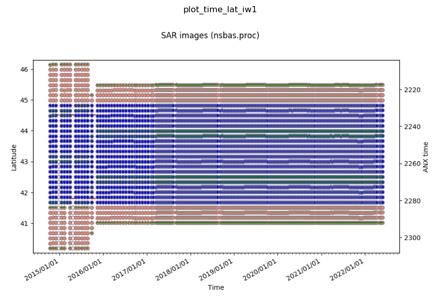

### Interferogram network (blue = kept, red = removed)
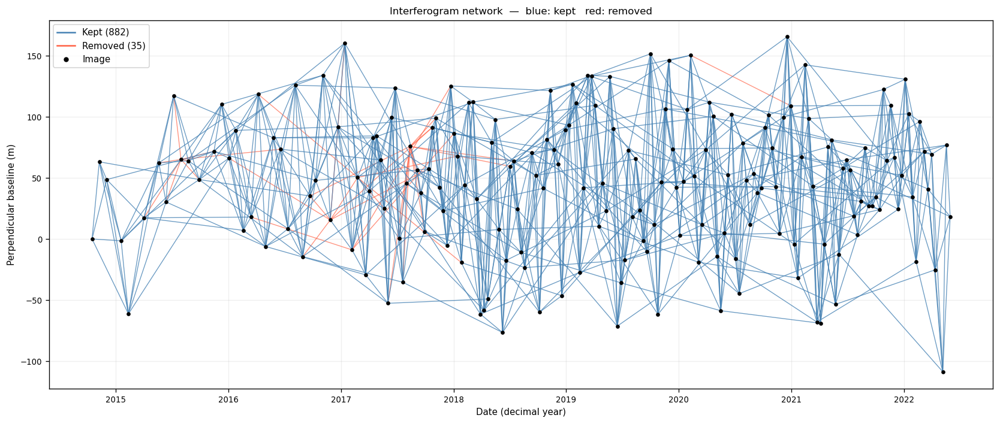

### Histogram of kept interferograms by temporal baseline
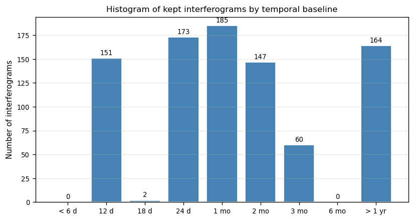

### Interferogram RMS vs temporal baseline + per-ifg index
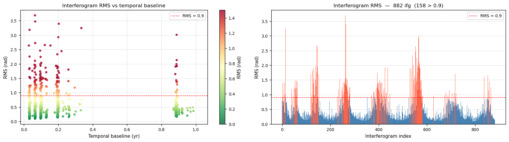

### Ramp residuals — per-IFG variance vs per-image APS
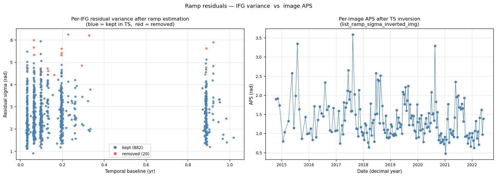

### SD variation along range and azimuth (IW1/2/3)
| Range | Azimuth |
|-------|---------|
| 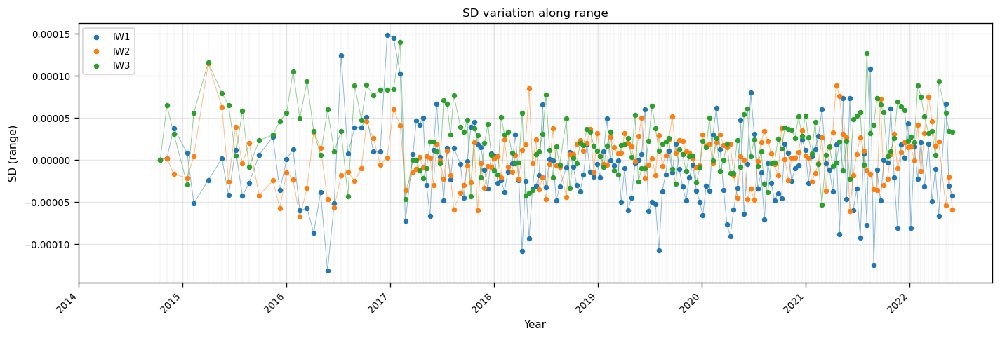 | 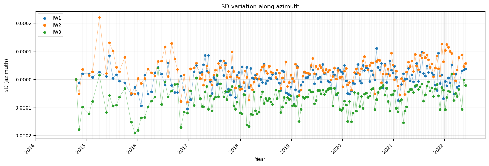 |

### SD constant term and sigma
| Constant term | Sigma |
|---------------|-------|
| 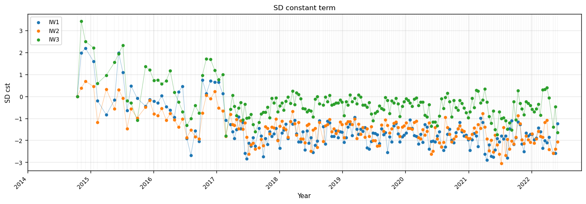 | 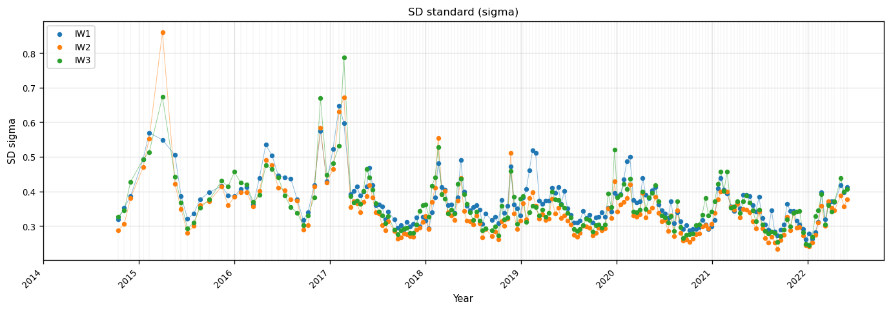 |

### SD tôle ondulée and quadratic azimuth
| Tôle ondulée | Quadratic azimuth |
|--------------|-------------------|
| 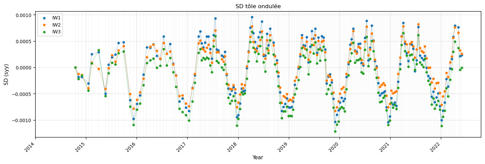 | 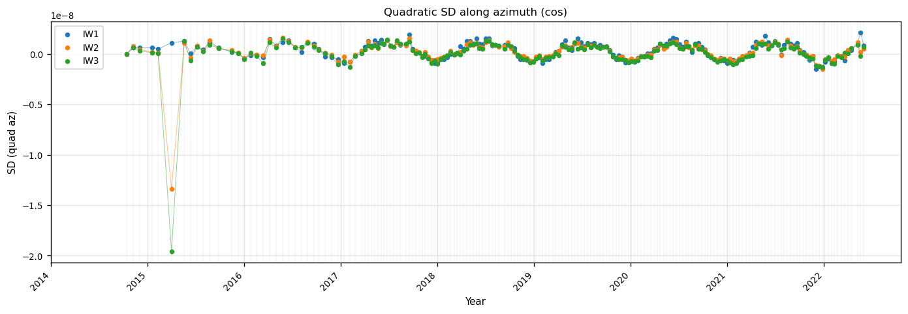 |

### Unwrapping fraction vs season (1-yr ifg)
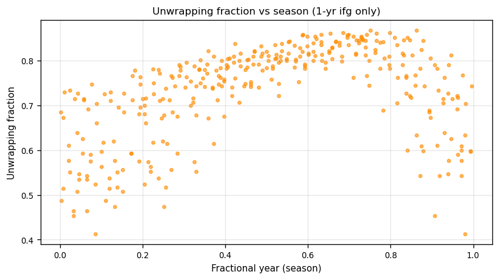

---

## Output figures — `check_results.py`

| Step | Figure | Content |
|------|--------|---------|
| 1 | `check_plot_time_lat_iw*.png` | Burst time-latitude distribution (one per subswath) |
| 2 | `check_sd_sx.png` | SD variation along range (IW1/2/3, click → date) |
| 2 | `check_sd_sy.png` | SD variation along azimuth |
| 2 | `check_sd_qy.png` | Quadratic SD along azimuth |
| 2 | `check_sd_syy.png` | SD tôle ondulée |
| 2 | `check_sd_sigma.png` | SD sigma |
| 2 | `check_sd_cst.png` | SD constant term |
| 3 | `check_iw_merge.png` | Phase jumps IW1-IW2 and IW2-IW3 |
| 4 | *(console)* | Interferogram statistics summary |
| 5 | `check_histo_bt.png` | Histogram of kept ifg by Bt (ascending) |
| 6 | `check_unw_frac_vs_bt.png` | Unwrapping fraction vs Bt |
| 6 | `check_unw_frac_vs_season.png` | Unwrapping fraction vs season (1-yr ifg) |
| 7 | `check_rms_date.png` | Per-date RMS |
| 8 | `check_rms_ifg_vs_bt.png` | Ifg RMS vs Bt + ifg RMS in original order |
| 9 | `check_variance_comparison.png` | Per-IFG variance (blue=kept, red=removed) + per-image APS |
| 10 | `check_ifg_network.png` | Interferogram network (blue=kept, red=removed) |
| 11 | `check_sigma_vs_time.png` | Per-image APS vs time (one curve per iteration) |
| 12 | `check_coeff_maps.png` | lin_coeff, ampwt_coeff, phiwt_coeff, ref_coeff |
| 13 | `check_velocity_maps.png` | FLATSIM MV-LOS vs lin_coeff vs RMSpixel |
| 13 | `check_seasonal_maps.png` | Seasonal maps: amplitude, phase, cos, sin |

## Output figures — `check_results_inc.py`

Same plots overlaid new (blue) vs previous (red), prefixed with `inc_`.

---

## CLI reference

```
check_results.py      <track_dir>  [--aux DIR] [--save DIR] [--no-display] [--prepare]
check_results_inc.py  <new_track>  <prev_track>
                      [--aux DIR] [--prev-aux DIR] [--save DIR] [--no-display]
invers_temp.py        <track_dir>
                      [--niter N] [--linear yes/no] [--seasonal yes/no]
                      [--semianual yes/no] [--bianual yes/no] [--steps t1,t2]
                      [--cte_coh 0.5] [--rmsl 10.0] [--nproc N]
                      [--rms PATH|none] [--aps PATH|none]
                      [--cube PATH] [--list_images PATH]
                      [--dateslim dmin,dmax] [--imref N] [--plot yes/no]
```

Both `check_results.py` and `invers_temp.py` accept either the **track directory**
(containing `TS/` and `AUX/`) or the **TS directory** directly.
